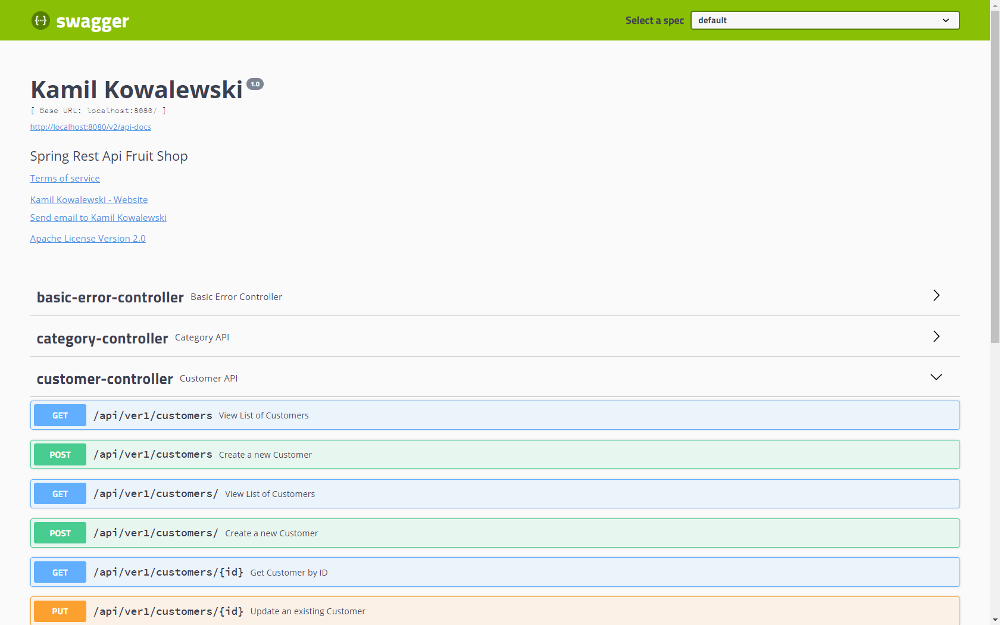
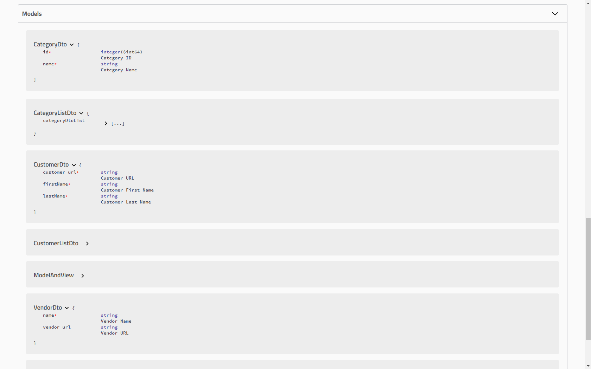

# RestApiFruitShop

Spring Boot (ver. 2.1.8) project of Rest API Fruit Shop.

Project has been initialized with Spring Initializr https://start.spring.io/

### Technologies and Maven dependencies used in project
* Maven - Project Management
* Intellij IDEA Ultimate
* JDK 8
* JPA
* H2 database
* Mapstruct
* Swagger
* JUnit 4
* Mockito
* JaCoCo
* Checkstyle
* Commons-lang3

#### Fruit Shop API  Swagger Docs
##### Controllers

##### Model

