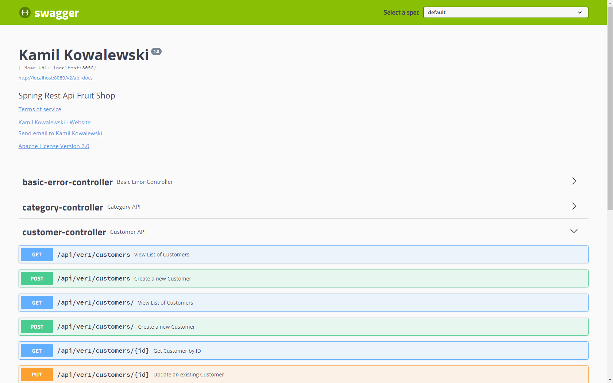
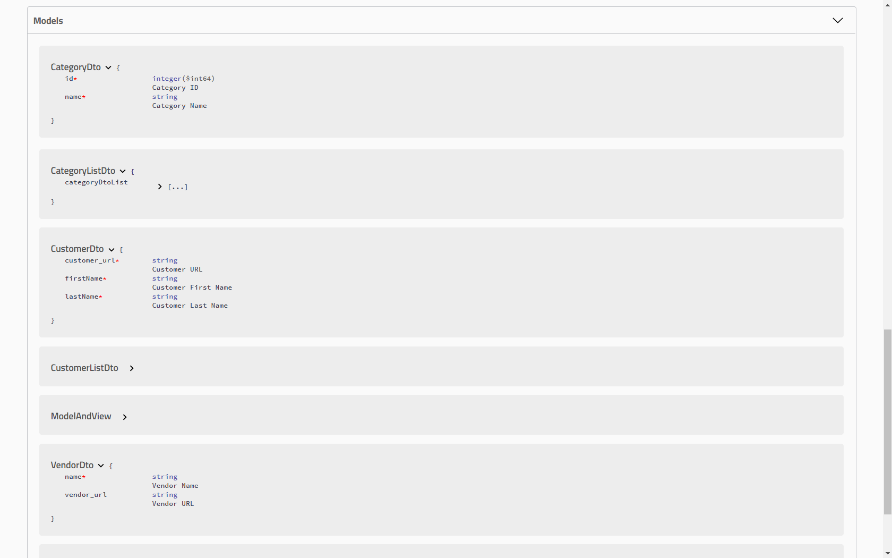

# RestApiFruitShop

Spring Boot (ver. 2.2.4.RELEASE) project of Rest API Fruit Shop.

Project has been initialized with Spring Initializr https://start.spring.io/

### Technologies and Maven dependencies used in project
* Maven - Project Management
* Intellij IDEA Ultimate
* JDK 11
* Spring Data JPA
* PostgreSQL
* H2 database
* Mapstruct
* Swagger
* JUnit 5
* Mockito
* Lombok
* JaCoCo
* Checkstyle
* Commons-lang3

### Important Notes
* In order to run application PostgreSQL must be installed and database must be created - database name 
can be changed in `application.properties` as well as port number (default name `fruit_shop`, port `5432`) 
or there is possibility to comment out settings in application.properties file and use H2 in memory 
database just for testing. Currently `spring.jpa.hibernate.ddl-auto` is set to `create-drop` but for 
production must be change to `update`.

#### Fruit Shop API  Swagger Docs
##### Controller

##### Model

